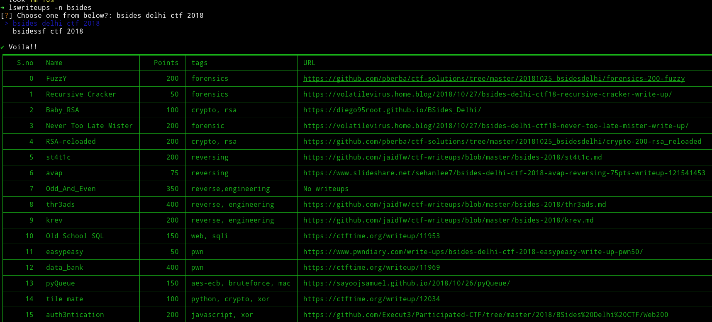
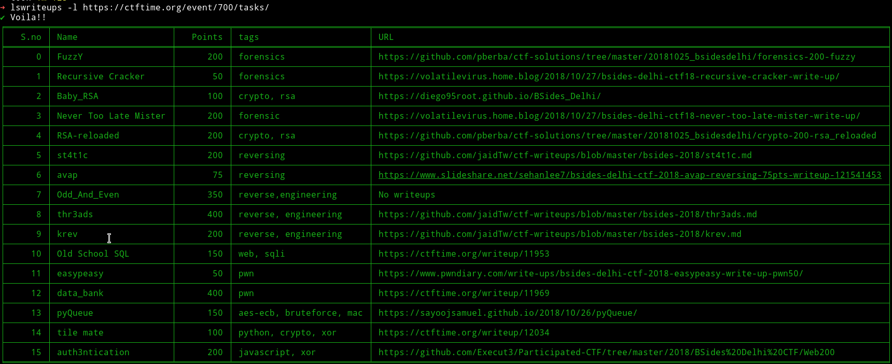

# lswriteups

A simple CLI tool to get the links of original writeups from [ctftime.org](https://ctftime.org).

If you paritcipate in CTFs and use ctftime for reading the writeups of tasks you couldn't solve, then you'll understand the pain it is to read a single writeup. If not then go to [ctftime](https://ctftime.org) and feel the pain :smirk:

This tool get's you all those beautifully written `original writeups` link so you can easily read them.

### Usage

```bash
➜ ./lswriteups -h
usage: main.py [-h] (-n NAME | -l LINK)

Easily get those precious writeups

optional arguments:
  -h, --help            show this help message and exit

required any one of them:
  -n NAME, --name NAME  search for writeups by CTF name
  -l LINK, --link LINK  search for writeups by CTF url
```

There is a choice, either you can enter the name of the CTF like `seccon` or `P.W.N` or you can provide direct link to the task of any CTF like `https://ctftime.org/event/639/tasks/`

* `./lswriteups -n seccon`



* `./lswriteups -l https://ctftime.org/event/683/tasks/`



### Installation

* You'll need python3 for this.
* Clone this repo:
    - `git clone https://github.com/mzfr/lswriteups`
* Install dependencies:
    - `pip install -r requirements.txt`

For easy usage you can add the path to the cloned folder in you shells configuration file i.e add the following line to you `.bashrc` or `.zshrc`

```
export PATH=$HOME/lswriteups:$PATH
```

__NOTE__: If you have cloned the repo in some other directory then use that path in place of `/lswriteups`

### Known issue

* This is pretty slow because there are lots of places where a GET requests is send so it will be effected by the speed of you connection.

If you have any suggestion for improving this or if you find any bug then feel free to open an issue.

### Say Thanks

If you like to :tada: [say thanks](https://saythanks.io/to/mzfr) :smile:
